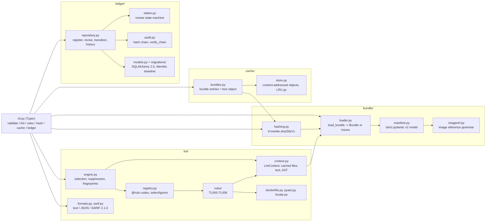

# TaskLedger

[](https://github.com/vipul21435/taskledger/actions/workflows/ci.yml)


Submission pipeline tooling for teams that build benchmark tasks for AI coding
agents: schema-checked task bundles, review lint rules, a canonical content
hash, a content-addressed dedupe cache, near-duplicate detection with MinHash
and LSH, and a shared collision ledger with a review state machine and a
hash-chained audit log. Build locks and review gates are on the roadmap.

A benchmark task is a small bundle: an instruction, a pinned environment image,
a reference solution and a byte-exact grader. When dozens of people author
tasks in parallel, the expensive failures are in the pipeline, not in any one
task: two authors submit the same task with cosmetic differences, a grader
quietly downloads something at test time, an image tag drifts after review, or
a grader samples the output with an unseeded random generator. TaskLedger
catches those before a reviewer ever sees the task.

## What works today

| Command | What it does |
| --- | --- |
| `taskledger validate PATH...` | Strict pydantic v2 schema for `task.toml` plus on-disk path checks. Reports every problem at once with a precise location (`task.toml:task.version`). `--json` for machines. |
| `taskledger lint PATH...` | Rule registry with stable codes, per-rule severity and fix hints, ruff-style `--select`/`--ignore` by code or prefix (also from `[lint]` in `task.toml`), inline `taskledger: ignore[TL004]` suppression, text, JSON or SARIF 2.1.0 output with line and column. |
| `taskledger rules` | Lists the registered rules (`--json` for machines). |
| `taskledger hash PATH` | Canonical Merkle-style sha256 of a bundle: cosmetic edits (line endings, manifest formatting, author metadata, OS clutter) never change it, any semantic edit always does. This is the identity for exact-duplicate detection. |
| `taskledger similar PATH...` | Near-duplicate pairs among bundles: pure-Python seeded MinHash over instruction word shingles and normalized solution tokens (identifiers renamed, comments and layout dropped), an LSH index whose bands and rows are chosen from `--threshold`, and both similarities per pair. Exit 1 if any pair is found. `--json` for machines. |
| `taskledger cache put\|get\|has\|gc` | Content-addressed object store (dedupe cache): `objects/ab/cdef...` fan-out, atomic temp-file + `os.replace` writes, verify-on-read, size-bounded LRU garbage collection. A bundle is stored file by file under its canonical digests, so an identical or cosmetically different bundle writes nothing. |
| `taskledger ledger init\|register\|check\|revise\|status\|transition\|history\|verify` | Shared ledger on SQLAlchemy 2.0 with an Alembic baseline (SQLite by default; another URL via `--db` or `TASKLEDGER_DATABASE_URL`, with `psycopg` from the optional `postgres` extra for Postgres, which the tests do not exercise yet): exact collisions by canonical hash enforced by a unique constraint, ID collisions with case and separator folding, near-duplicates from MinHash signatures and LSH buckets stored in the ledger (`check` reports all three kinds together; `register` refuses a near-duplicate unless `--allow-near-dup`, which is audited), a review state machine with typed errors, and an append-only, hash-chained audit log with `verify`. |

Lint rules shipped (`taskledger rules`):

| Code | Name | Default | Catches |
| --- | --- | --- | --- |
| TL000 | invalid-bundle | error | anything `validate` rejects |
| TL001 | missing-tests | error | no grader tests, or pytest files whose tests assert nothing |
| TL002 | unpinned-base-image | error | `FROM` / `COPY --from` without `@sha256:` (multi-stage and `ARG`-substituted forms included) |
| TL003 | network-in-grader | error | network imports in the grader, `curl`/`wget`/`pip install`/`git clone` in tests, the verifier command or the verifier image's `CMD`/`ENTRYPOINT` |
| TL004 | nondeterminism | warning | wall clock, OS entropy, unseeded global `random`/`numpy.random`, salted `hash()`, set-order dependent output and unsorted directory listings in the grader or reference solution |
| TL005 | oversized-file | error | a file over `lint.max_file_kb` (default 1024 KiB) or a bundle over `lint.max_bundle_kb` (default 20480 KiB), with the largest files named |
| TL006 | committed-secret | error | 16 known key formats (cloud, code-hosting, chat, payment and model-provider keys, registry tokens, JWTs, PEM private keys, passwords in URLs) plus a Shannon-entropy check on values assigned to secret-looking names; findings are redacted |

Also shipped: two original, genuinely solvable example bundles, one
deliberately flawed bundle for the demo, a digest-pinned non-root Docker image,
and `make demo` (validate, lint, hash, cache, register, collide, review,
verify).

## Quickstart

Requires [uv](https://docs.astral.sh/uv/) and GNU make (uv installs Python 3.12
if needed). Verified from a fresh clone:

```bash
git clone https://github.com/vipul21435/taskledger.git
cd taskledger
uv sync --frozen
make demo     # validate, lint, hash, cache and register the bundled examples (offline)
make check    # ruff, mypy --strict, pytest with branch coverage
```

Or in Docker (the image carries the examples and the demo script):

```bash
make docker-demo   # docker build -t taskledger:dev . then runs scripts/demo.sh inside it
docker run --rm -v "$PWD:/work" taskledger:dev lint /work/examples/bundles/integer-linear-system
```

## CLI usage

All output below is copied from real runs in this repository.

### Lint

```console
$ taskledger lint --no-hints examples/flawed/digit-sum-report
examples/flawed/digit-sum-report/environment/Dockerfile:2:6: error TL002 unpinned-base-image: base image 'python:3.12-slim' is not pinned by digest
examples/flawed/digit-sum-report/task.toml:21:1: error TL003 network-in-grader: verifier command runs 'pip install' at test time
examples/flawed/digit-sum-report/tests/test_report.py:7:1: error TL003 network-in-grader: grader imports network module 'requests'
examples/flawed/digit-sum-report/tests/test_report.py:10:19: error TL006 committed-secret: 'UPSTREAM_TOKEN' is assigned a high-entropy value (4.6 bits per character) that looks like a secret: [redacted, 24 chars]
examples/flawed/digit-sum-report/tests/test_report.py:16:14: warning TL004 nondeterminism: 'random.sample()' uses the global random generator, never seeded in this file
examples/flawed/digit-sum-report/tests/test_report.py:23:56: warning TL004 nondeterminism: 'time.time()' reads the wall clock, so the result changes between runs
examples/flawed/digit-sum-report/verifier/Dockerfile:1:6: error TL002 unpinned-base-image: base image 'python:3.12-slim' is not pinned by digest
Found 7 findings (5 errors, 2 warnings) in 1 of 1 bundle.
$ echo $?
1

$ taskledger lint examples/bundles/*
No findings in 2 bundles.
```

Without `--no-hints` each finding is followed by its fix hint, for example
`fix: Pin the image by digest, e.g. FROM python:3.12-slim@sha256:<digest> (get
it with: docker buildx imagetools inspect python:3.12-slim).` Exit codes: 0
clean or warnings only, 1 on any error, 2 on an unknown rule code.
`--format json` emits a versioned document (`format_version: 1`) with a
summary and, per finding, code, rule, severity, file, line, column, fix and a
line-independent fingerprint:

```console
$ taskledger lint --format json examples/flawed/digit-sum-report
{
  "tool": "taskledger",
  "version": "0.1.0",
  "format_version": 1,
  "summary": {
    "bundles": 1,
    "bundles_with_findings": 1,
    "findings": 7,
    "error": 5,
    "warning": 2,
    "note": 0,
    "suppressed": 0
  },
  ...
```

### SARIF for GitHub code scanning

`--format sarif` writes one SARIF 2.1.0 log with a single run. The driver
lists every rule that ran (id, title, description, the fix hint as help, the
default level; TL006 is tagged `security` with a `security-severity` of 8.0),
and each finding becomes a result with `ruleId` and `ruleIndex`, level,
message, a physical location and a line-independent partial fingerprint.
Relative paths become percent-encoded URIs under `%SRCROOT%`, so run the
linter from the repository root; absolute paths become `file://` URIs.

```console
$ taskledger lint --format sarif examples/flawed/digit-sum-report > lint.sarif; echo $?
1
$ head -4 lint.sarif
{
  "$schema": "https://json.schemastore.org/sarif-2.1.0.json",
  "version": "2.1.0",
  "runs": [
```

One of its 7 results (the redacted TL006 secret):

```json
{
  "ruleId": "TL006",
  "ruleIndex": 6,
  "level": "error",
  "message": {
    "text": "'UPSTREAM_TOKEN' is assigned a high-entropy value (4.6 bits per character) that looks like a secret: [redacted, 24 chars]"
  },
  "locations": [
    {
      "physicalLocation": {
        "artifactLocation": {
          "uri": "examples/flawed/digit-sum-report/tests/test_report.py",
          "uriBaseId": "%SRCROOT%"
        },
        "region": {
          "startLine": 10,
          "startColumn": 19,
          "endLine": 10,
          "endColumn": 43
        }
      }
    }
  ],
  "partialFingerprints": {
    "taskledger/v1": "4f47be9beb1c4d8e70905dd469d32298"
  }
}
```

`taskledger.lint.sarif_problems(document)` checks a log against every
property the SARIF 2.1.0 schema marks as required (plus its enums and
minimums, and that each `ruleIndex` points at the rule with the result's id)
and the result fields GitHub code scanning requires (`ruleId`,
`message.text`, an artifact URI and `region.startLine`). The tests run it
over real lint output and over hypothesis-generated reports, and delete or
corrupt each required field of a valid log to prove the check is enforced
(`tests/test_lint_sarif.py`). CI also uploads the log for the (clean) sample
bundles to this repository's code scanning on every push to `main`, and
GitHub processes it without errors; the result objects themselves are covered
by the checker, since the sample bundles produce none. In a workflow, keep
the upload step running when the lint step fails:

```yaml
- run: uv run taskledger lint --format sarif examples/bundles/* > lint.sarif
- uses: github/codeql-action/upload-sarif@v4
  if: always()
  with:
    sarif_file: lint.sarif
    category: taskledger
```

### Secrets and size limits

TL006 scans every text file line by line (files above the 4 MiB content cache
are streamed, so size never hides a key) and never prints the credential: a
known format keeps only its public prefix (`ghp_[redacted, 40 chars]`), a
generic secret only its length. The entropy check only looks at values
assigned to secret-looking names (`api_key`, `"token":`, `DB_PASSWORD=`,
`os.environ["API_KEY"] =`, `--api-key=`), so sha256 digests and base64
fixtures do not trip it, and placeholders such as `changeme`, `${TOKEN}`,
`$TOKEN` or `<token>` are skipped. Passwords in URLs are caught with or
without a username (`redis://:pw@host`), but a `@` after `?` or `#` (a query
string) is not a password. Both scans are linear in the line length: a 200,000
character DNA, hex or base64 line scans in well under a second
(`tests/test_lint_rule_tl006.py`). TL005 limits come from
`[lint]` in `task.toml`:

```toml
[lint]
max_file_kb = 1024      # per file (default)
max_bundle_kb = 20480   # whole bundle (default)
```

### Validate

```console
$ taskledger validate examples/bundles/*
ok       examples/bundles/integer-linear-system  (integer-linear-system 1.0.0)
ok       examples/bundles/modular-inverse-table  (modular-inverse-table 1.0.0)

$ taskledger validate broken
invalid  broken  (4 issue(s))
  task.toml:task.id: must be a lowercase slug of 3-64 characters (letters, digits and single hyphens), got 'Modular_Inverse'
  task.toml:task.version: must be a semantic version such as 1.0.0 or 2.1.0-rc.1, got '1.0'
  task.toml:instruction.path: must stay inside the bundle, got '../instruction.md'
  task.toml:resources.cpus: Input should be a valid number
```

(`broken` is a copy of `examples/bundles/modular-inverse-table` with those four
manifest values edited.) Schema errors are reported first; once the manifest
is valid, every declared path is checked on disk (`file not found`, `expected
a directory`, `resolves outside the bundle`).

### Hash

| Never changes the hash (cosmetic) | Always changes the hash (semantic) |
| --- | --- |
| CRLF or CR line endings in text files | any other byte of any file |
| `task.toml` comments, whitespace, key and table order, quoting, defaults written out | any other manifest value (title, version, tags, limits, command, ...) |
| `authors`, `created_at`, `notes` metadata | adding, removing or renaming a file |
| `.DS_Store`, `__pycache__`, `*.pyc`, `.git`, tool caches | retargeting a symlink (links are hashed, never followed) |
| empty directories, file modes, timestamps, NFC vs NFD file names | |

Real run on a copy of `examples/bundles/modular-inverse-table` (every text
file converted to CRLF, a `.DS_Store` added, the author changed, then one
grader line appended):

```console
$ taskledger hash .
sha256:0991c712d5e379e7cad99b4acebfcd916dcc90ea5e997c8684d6e44846c6c2aa  .
$ # CRLF everywhere, .DS_Store, different author
$ taskledger hash .
sha256:0991c712d5e379e7cad99b4acebfcd916dcc90ea5e997c8684d6e44846c6c2aa  .
$ echo "# stricter" >> tests/test_inverses.py
$ taskledger hash .
sha256:22da1ce1dd43cfb2814c25bdf60c719740e0acdff3a2917c9b338449ce08d93f  .
```

The same bundle hashes identically on macOS (arm64) and inside the Linux
container (`make demo` and `make docker-demo` print the same digests).
`--json` adds per-file digests; for LF-only text a file digest equals
`sha256sum`.

### Dedupe cache

`taskledger cache` is a content-addressed object store under
`$TASKLEDGER_HOME/cache` (default `.taskledger/cache`, or `--cache-dir`). A
bundle is stored entry by entry under its canonical per-file digests (the
same digests the bundle hash is built from) plus one tree object, so a second
copy of a bundle, or a copy with only cosmetic edits, writes nothing:

```console
$ taskledger cache put examples/bundles/modular-inverse-table
sha256:7f63fb2cee4940a96c2dd0371b92600aded5cba3286a2ace486e2c5268e33f19  examples/bundles/modular-inverse-table  (stored: bundle sha256:0991c712d5e379e7cad99b4acebfcd916dcc90ea5e997c8684d6e44846c6c2aa, 9 of 9 objects new, 6600 of 6600 bytes written)
$ taskledger cache put examples/bundles/modular-inverse-table
sha256:7f63fb2cee4940a96c2dd0371b92600aded5cba3286a2ace486e2c5268e33f19  examples/bundles/modular-inverse-table  (already cached: bundle sha256:0991c712d5e379e7cad99b4acebfcd916dcc90ea5e997c8684d6e44846c6c2aa, 0 of 9 objects new, 0 of 6600 bytes written)
$ taskledger cache get sha256:7f63fb2cee4940a96c2dd0371b92600aded5cba3286a2ace486e2c5268e33f19 | head -c 120
{"bundle_hash":"sha256:0991c712d5e379e7cad99b4acebfcd916dcc90ea5e997c8684d6e44846c6c2aa","entries":[{"kind":"text","obje
$ taskledger cache has sha256:7f63fb2cee4940a96c2dd0371b92600aded5cba3286a2ace486e2c5268e33f19 sha256:0000000000000000000000000000000000000000000000000000000000000000
present  sha256:7f63fb2cee4940a96c2dd0371b92600aded5cba3286a2ace486e2c5268e33f19
missing  sha256:0000000000000000000000000000000000000000000000000000000000000000
$ echo $?
1
$ taskledger cache gc --max-size 4K
removed 6 object(s), freed 2684 bytes; kept 3 object(s), 3916 bytes (budget 4096); 0 stale temp file(s) removed
```

In `make demo`, the copy of a bundle with one edited file stores `2 of 9
objects new` (the changed file and a new tree). Plain files work too
(`taskledger cache put notes.txt`). Writes go to `tmp/`, are fsynced and
renamed into place with `os.replace`, so readers never see a partial object
and racing writers of one key both succeed (16 threads in
`tests/test_cache_store.py`). `get` rehashes what it read; an object whose
bytes no longer match its key is deleted and reported (exit 1). `get` and a
repeated `put` refresh an object's modification time, and `gc` deletes the
least recently used objects until the store fits the budget, plus temp files
older than an hour left by crashed writers.

### Near-duplicates

`taskledger similar` catches resubmissions that the canonical hash cannot:
a reworded instruction or a solution with renamed variables and new comments.
Run from a directory holding copies of the two sample bundles, where
`resubmitted-solver` is a copy of `integer-linear-system` whose
instruction was rewritten by hand and whose `solve.py` had every local
identifier renamed and comments and blank lines added (the `disguise` helper
in `tests/paraphrase_corpus.py`):

```console
$ taskledger similar bundles/integer-linear-system bundles/modular-inverse-table
No near-duplicates among 2 bundle(s) at threshold 0.5.
$ taskledger similar bundles/integer-linear-system bundles/modular-inverse-table bundles/resubmitted-solver
near-dup  1.00  bundles/integer-linear-system  bundles/resubmitted-solver  (instruction 0.06, solution 1.00)
$ echo $?
1
$ taskledger similar --json bundles/integer-linear-system bundles/resubmitted-solver
{
  "threshold": 0.5,
  "bands": 25,
  "rows": 5,
  "pairs": [
    {
      "a": "bundles/integer-linear-system",
      "b": "bundles/resubmitted-solver",
      "similarity": 1.0,
      "instruction_similarity": 0.0625,
      "solution_similarity": 1.0
    }
  ]
}
```

How it works (`src/taskledger/neardup/`):

- **Shingles.** Instructions become lower-cased word 3-grams. Solutions are
  tokenized with Python's `tokenize` (regex fallback for other languages):
  comments, docstrings and layout are dropped, string literals become `STR`,
  and every identifier that is not a keyword or builtin becomes `ID0`,
  `ID1`, ... in order of first use; then token 5-grams.
- **MinHash.** 128 universal hash functions `(a*x + b) mod (2**61 - 1)` with
  coefficients derived from a seed via BLAKE2b, so signatures are identical
  across processes, machines and `PYTHONHASHSEED`.
- **LSH.** Bands and rows minimize the false positive plus false negative
  area under the S-curve `1 - (1 - s**r)**b` for the threshold (25 bands of 5
  rows at 0.5). Candidates are confirmed with the signature estimate, and a
  pair is reported when either the instruction or the solution similarity
  reaches the threshold.

The library is also usable directly (`NearDupIndex`, `fingerprint_bundle`).

The ledger stores each submission's signatures and its LSH band buckets
(tables `task_signatures` and `lsh_buckets`, Alembic revision 0002), so
finding candidates is one indexed query. `taskledger ledger check` reports
exact, ID and near-duplicate collisions together without writing anything,
and `register` refuses a near-duplicate unless `--allow-near-dup` is given,
in which case the matches go into the audit entry. Same scratch directory,
with `resubmitted-solver` given the ID `linear-system-v2`:

```console
$ taskledger ledger register --actor alice bundles/integer-linear-system
registered  integer-linear-system 1.0.0  draft  sha256:dba0892dac61f512e0a6540307f98e373fa9895f56872c4e8edf0bcfb938e4ea
$ taskledger ledger check bundles/resubmitted-solver
near-dup  integer-linear-system  1.00  (instruction 0.06, solution 1.00)
$ taskledger ledger register --actor bob bundles/resubmitted-solver
error: near-duplicate: 'linear-system-v2' is 1.00 similar to 'integer-linear-system' (instruction 0.06, solution 1.00; threshold 0.5); 1 match(es) in total. Use --allow-near-dup (allow_near_dup=True) to register anyway; the matches are then recorded in the audit log.
$ taskledger ledger check bundles/integer-linear-system
exact     integer-linear-system  (same canonical hash sha256:dba0892dac61f512e0a6540307f98e373fa9895f56872c4e8edf0bcfb938e4ea)
id        integer-linear-system  (folds to the same ID as 'integer-linear-system')
near-dup  integer-linear-system  1.00  (instruction 1.00, solution 1.00)
$ taskledger ledger register --actor bob --allow-near-dup bundles/resubmitted-solver
registered  linear-system-v2 1.0.0  draft  sha256:82058fca8996f97f2f26310d34f59e5427a6a2ca11cde92e4456dc530555d54d
$ taskledger ledger history linear-system-v2
   2  2026-09-28T23:15:48.362657+00:00  bob  register  linear-system-v2  {"content_hash":"sha256:82058fca8996f97f2f26310d34f59e5427a6a2ca11cde92e4456dc530555d54d","near_duplicates_allowed":[{"instruction_similarity":0.0625,"similarity":1.0,"slug":"integer-linear-system","solution_similarity":1.0}],"status":"draft","threshold":0.5,"version":"1.0.0"}  e2040d4b2132
$ taskledger ledger check bundles/modular-inverse-table
clear     bundles/modular-inverse-table  (no exact, ID or near-duplicate collision)
```

Every `check` or `register` that finds a collision exits 1. The buckets are
cut for threshold 0.5 (25 bands of 5 rows); `--threshold` changes the
confirmation step only, so thresholds well below 0.5 lose recall. The
near-duplicate check runs before the registration transaction, so two
near-duplicate registrations racing each other can both pass it (exact and
ID collisions are still decided by unique constraints).

### Ledger

`taskledger ledger` keeps tasks, submissions, content hashes and an audit log
in one database: `--db URL`, else `TASKLEDGER_DATABASE_URL`, else SQLite at
`$TASKLEDGER_HOME/ledger.db`. Every command first upgrades the schema to the
Alembic head, so `init` is optional and safe to repeat.

```console
$ taskledger ledger init
ledger ready at sqlite:///.taskledger/ledger.db (schema revision 0002)
$ taskledger ledger register --actor alice examples/bundles/modular-inverse-table
registered  modular-inverse-table 1.0.0  draft  sha256:0991c712d5e379e7cad99b4acebfcd916dcc90ea5e997c8684d6e44846c6c2aa
$ taskledger ledger register --actor bob examples/bundles/modular-inverse-table
error: exact collision: sha256:0991c712d5e379e7cad99b4acebfcd916dcc90ea5e997c8684d6e44846c6c2aa is already registered as modular-inverse-table 1.0.0
$ echo $?
1
$ echo "Print one inverse per line." >> edited/instruction.md   # edited = a copy of the bundle
$ taskledger ledger register --actor bob edited
error: ID collision: 'modular-inverse-table' folds to 'modularinversetable', already used by the same ID with different content
```

IDs are compared case folded with `-`, `_`, `.` and spaces removed, so
`Matrix_Rank` collides with `matrix-rank`. Review status follows a state
machine; anything else is refused with a typed `IllegalTransitionError`:

```
draft -> submitted -> in_review -> accepted | rejected | needs_changes
needs_changes -> submitted            (accepted and rejected are final)
```

```console
$ taskledger ledger transition --actor alice modular-inverse-table submitted
modular-inverse-table: draft -> submitted
$ taskledger ledger transition --actor reviewer modular-inverse-table in_review
modular-inverse-table: submitted -> in_review
$ taskledger ledger transition --actor reviewer --note "grader reads a fixed path" modular-inverse-table needs_changes
modular-inverse-table: in_review -> needs_changes
$ taskledger ledger transition --actor reviewer modular-inverse-table accepted
error: modular-inverse-table: cannot move from needs_changes to accepted (allowed from needs_changes: submitted)
$ taskledger ledger history modular-inverse-table
   1  2026-09-28T22:36:41.581806+00:00  alice  register  modular-inverse-table  {"content_hash":"sha256:0991c712d5e379e7cad99b4acebfcd916dcc90ea5e997c8684d6e44846c6c2aa","status":"draft","version":"1.0.0"}  bcb7c02bd0da
   2  2026-09-28T22:37:11.566011+00:00  alice  transition  modular-inverse-table  {"from":"draft","to":"submitted"}  fee0395a632c
   3  2026-09-28T22:37:12.228363+00:00  reviewer  transition  modular-inverse-table  {"from":"submitted","to":"in_review"}  52e0ce293944
   4  2026-09-28T22:37:12.612071+00:00  reviewer  transition  modular-inverse-table  {"from":"in_review","note":"grader reads a fixed path","to":"needs_changes"}  4a7dd8845528
$ taskledger ledger verify
audit chain ok: 4 entries, head 4a7dd8845528dc9b1ab37bf99e11f7a67b4970a51f5ec450675dd2d279304ed4
```

`revise` records new content for a task in `draft` or `needs_changes`
(status unchanged); earlier contents stay claimed, so resubmitting any
content the ledger has seen, including an older revision of the same task,
is an exact collision:

```console
$ taskledger ledger revise --actor alice edited
revised     modular-inverse-table 1.0.0  needs_changes  sha256:0b5d3bfe98cf220eb8b66d9064191822b5f424f37faaa3376dc4ba49fe662b25
$ taskledger ledger transition --actor alice modular-inverse-table submitted
modular-inverse-table: needs_changes -> submitted
$ taskledger ledger revise --actor alice edited
error: modular-inverse-table: cannot revise content in status submitted (only in draft or needs_changes)
```

The audit log is append-only in the database and tamper-evident outside it.
Triggers refuse `UPDATE` and `DELETE`; each row stores the previous row's
hash and its own sha256 over canonical JSON of every column, so a row edited
after the triggers are dropped (or in a restored backup) is caught by
`verify`, which exits 1 and names the first bad row:

```console
$ sqlite3 ledger.db "UPDATE audit_log SET actor = 'mallory' WHERE seq = 2"
Error: stepping, audit_log is append-only (19)
$ # the same edit after dropping the trigger:
$ taskledger ledger verify
audit chain BROKEN at seq 2: row content does not match its hash (row edited) (1 entries verified before it)
```

Deleting the newest rows leaves a valid prefix, so compare `verify`'s head
with one recorded earlier to detect truncation. All commands take `--json`
where they print records (`register`, `revise`, `status`, `history`,
`verify`).

## Architecture



- **Rules never touch the file system.** They ask `LintContext` for the
  layout, file list, text, lines or parsed AST; every read and parse is cached
  per bundle, so five rules looking at one file cost one read.
- **The layout comes from the manifest, best effort.** If `task.toml` is
  invalid, each section is validated on its own and falls back to the
  conventional layout only where it is broken, so a typo in `[task]` does not
  hide a missing grader (TL000 reports the typo, the other rules still run).
- **Names are resolved, not spelled.** `pyast.ImportTable` maps local names to
  fully qualified ones, so `from datetime import datetime as dt; dt.now()` is
  matched as `datetime.datetime.now`.

## Measured numbers

Every number below comes from a command run on this repository at the commit
that last updated this table (macOS arm64, Python 3.12, Docker 29).

| Metric | Value | Reproduce with |
| --- | --- | --- |
| Tests | 722 passed | `uv run pytest -q` |
| Branch coverage | 98.13% (gate: 85%; the Alembic scripts are exercised by the migration tests but loaded by Alembic's own importer, so coverage reports them as unexecuted) | `make cov` |
| Lint rules registered | 7 (TL000-TL006) | `uv run taskledger rules` |
| Findings on the flawed example | 7 (5 errors, 2 warnings), exit 1 | `uv run taskledger lint examples/flawed/digit-sum-report` |
| Findings on the two sample bundles | 0 | `uv run taskledger lint examples/bundles/*` |
| SARIF problems in the flawed example's log | 0 (`[]`; 7 results, 7 rules) | `uv run taskledger lint -f sarif examples/flawed/digit-sum-report \| uv run python -c "import json, sys; from taskledger.lint import sarif_problems; print(sarif_problems(json.load(sys.stdin)))"` |
| GitHub code scanning upload of the sample bundles' SARIF (CI `sarif` job) | processed: tool `taskledger`, 7 rules, 0 results, no errors or warnings | `gh api repos/vipul21435/taskledger/code-scanning/analyses --jq '.[0] \| {tool: .tool.name, rules_count, results_count, error, warning}'` |
| Near-duplicate recall and precision on the original paraphrase corpus (12 tasks indexed, 24 paraphrased resubmissions queried: reworded instruction plus renamed, commented or extended solution) | 24 of 24 found, 0 false matches (precision 1.0, recall 1.0) at threshold 0.5 | `uv run pytest -q tests/test_neardup.py -k precision_and_recall` |
| Word 3-gram Jaccard of each hand-written instruction paraphrase with its original | 0.12 to 0.48 (below 0.5, so on this corpus the solution signature does the catching) | `uv run python -c "import sys; sys.path.insert(0, 'tests'); from paraphrase_corpus import TASKS; from taskledger.neardup import jaccard, word_shingles; s = [jaccard(word_shingles(t.instruction), word_shingles(t.paraphrase)) for t in TASKS]; print(f'{min(s):.2f} {max(s):.2f}')"` |
| Objects written when the same bundle is cached twice | 9 of 9, then 0 of 9 | `taskledger cache put examples/bundles/modular-inverse-table` (twice) |
| Objects written for a copy with one edited file | 2 of 9 (the file and a new tree) | `make demo`, step 9 |
| Audit chain after the demo's review walk | ok, 4 entries | `make demo`, step 11 |
| `make demo` wall time | 11.46 s (24 CLI calls, each through `uv run`, measured with the machine's load average between 8 and 15) | `/usr/bin/time -p make demo` |
| Docker image (now with SQLAlchemy and Alembic) | 60.1 MB compressed, 280 MB unpacked | `make docker-build && docker image ls taskledger:dev` |

The hash properties in the table above are hypothesis property tests
(`tests/test_hashing_properties.py`; CI runs them with
`HYPOTHESIS_PROFILE=ci`, up to 400 examples per property). The sample bundles
are checked end to end by `tests/test_examples.py`: each grader must reject the
untouched baseline, accept the reference solution twice, and reject a
reference output with one extra line.

## Design decisions

- **Hash the validated manifest, not TOML bytes.** Canonical JSON of the model
  with defaults excluded and metadata dropped, so formatting and spelled-out
  defaults are cosmetic and a new defaulted field in a later schema version
  does not change existing hashes.
- **Text vs binary by NUL byte** (the usual git heuristic); only text gets
  line endings normalized, and the normalizer streams in chunks (a property
  test covers CRLF split across a chunk boundary).
- **Symlinks are hashed by target and never followed**; directory entries
  carry a kind byte, so a file and a directory can never collide.
- **Strict schema everywhere.** No `"5"` to `5` coercion, unknown keys are
  errors, every path must stay inside the bundle (also through symlinks).
- **Environment images build from `baseline/`**, so a reference solution can
  never leak into the agent image by construction.
- **Races resolve in the database.** The unique constraint on
  `content_hashes.hash` decides which of two concurrent registrations of the
  same content wins; the loser gets the same `ExactCollisionError` a
  sequential caller would (a test skips the pre-check to prove it). On SQLite
  every write transaction starts with `BEGIN IMMEDIATE`, so writers queue.
- **Status changes are compare-and-set** on the old status, and each change
  is written in the same transaction as its audit row, so the ledger's own
  commands never leave the task state and its history disagreeing. (Direct
  edits to the task tables are not detected, and `revise` is not yet
  compare-and-set; see Known issues.)
- **The audit hash covers canonical JSON** (sorted keys, ASCII) and the
  timestamp is stored as the exact string that was hashed, so verification
  does not depend on how a database round-trips datetimes.
- **Cache keys are the canonical digests.** Cached bundle entries are the
  LF-normalized text and canonical manifest, so a key is always
  `sha256(object bytes)` and verify-on-read needs no side table.
- **Near-duplicates match on either signature.** A reworded instruction over
  the same solution and a new instruction around a renamed copy of an old
  solution are both resubmissions, so each is scored on its own and reported
  separately; LSH only proposes candidates and the MinHash estimate decides.
- **Stable rule codes plus ruff-style selection.** Layers apply in order
  (`task.toml`, then CLI); the more specific selector wins and `ignore` wins a
  tie, so `--select TL004` on the command line re-enables a rule a bundle
  ignored.
- **Fingerprints ignore line numbers** (code, file, message, occurrence), so
  moving code does not make an old finding look new to code-scanning tools.
  The SARIF fingerprint also hashes the artifact URI, so the same finding in
  two bundles stays two alerts.
- **Secret findings are redacted at the source.** The rule builds the message
  from a redacted form, so no formatter, log or SARIF upload can leak the
  credential.
- **The image practices what TL002 preaches:** both base images in the
  Dockerfile are pinned by digest, dependencies come from `uv.lock`, and the
  runtime user is non-root (uid 10001).

## Task bundle format

A task bundle is a directory with a `task.toml` manifest. Every section except
`[task]` is optional and defaults to the conventional layout below.

```
modular-inverse-table/
  task.toml               manifest: id, semver version, images, limits
  instruction.md          what the agent is asked to do
  environment/Dockerfile  image the agent works in (digest-pinned base)
  verifier/Dockerfile     image the grader runs in
  solution/solve.sh       reference solution that computes the answer
  tests/                  byte-exact pytest grader
  baseline/               optional untouched starting workspace
```

A minimal manifest:

```toml
schema_version = 1

[task]
id = "sum-of-squares"        # lowercase slug, 3-64 chars
version = "1.0.0"            # semantic version
title = "Sum of squares of a list"
category = "arithmetic"
```

The full model lives in
[`src/taskledger/bundle/manifest.py`](src/taskledger/bundle/manifest.py).
Examples: [`examples/bundles/`](examples/bundles/) holds a modular-inverse
table over a composite modulus and a unimodular integer linear system
(determinant +1 or -1, so exactly one integer answer), both original, with
graders that recompute every answer independently and pin the input by digest.
[`examples/flawed/`](examples/flawed/) holds the bundle the demo lints.

## Known issues

Found in review and not fixed yet:

- **`cache put` fails on Linux for bundles with NFD file names.** `hash` and
  `ledger register` compare names in NFC and succeed, but `cache put` reopens
  each file by its NFC name, which a byte-for-byte filesystem (ext4, the
  Docker image) cannot find, so it exits 1. macOS (APFS) is not affected.
- **`ledger verify` checks only the audit chain.** It does not replay the log
  against the `tasks`, `submissions` and `content_hashes` tables, so a direct
  SQL `UPDATE` of a task's status or a `DELETE` of a claimed hash is not
  detected and `verify` still reports ok.
- **Ledger commands can end in a traceback** instead of an `error:` line when
  the database is locked past the busy timeout, the `--db` URL does not
  parse, the Postgres driver is not installed, the file is not a database, or
  the schema is at a revision this version does not know.
- **`revise` has no compare-and-set on status.** It checks the status and
  writes the new content in separate statements. SQLite is safe because every
  transaction takes the write lock first; on a backend without that (Postgres
  at READ COMMITTED) a concurrent submit could land in between. Found by
  reading the code, not reproduced.

## Roadmap

Not built yet; tracked slice by slice in [PLAN.md](PLAN.md).

- **Ledger follow-ups:** a CI job against a real Postgres service container
  (the baseline creates Postgres triggers for the audit log, but only SQLite
  is exercised by the tests today) and a multiprocessing registration race
  test (slice 5).
- **Near-duplicate follow-ups:** better instruction-only paraphrase detection
  (hand-written paraphrases share only 0.12-0.48 of their word 3-grams, see
  Measured numbers) and a race-free near-duplicate gate.
- **Build locks:** `fcntl` file locks, DB leases with fencing tokens and stale
  recovery, and a build cache so each environment is built once.
- **Review gates:** reference passes, baseline fails, grader determinism
  re-runs, with JSON, Markdown and JUnit reports and a composite GitHub Action
  that uploads the lint SARIF to code scanning.
- **Service:** FastAPI + Prometheus metrics, docker-compose with Postgres.
- **Benchmarks and docs:** throughput, near-dup precision/recall, lease
  contention, generated rule reference.

`.env.example` lists the settings: `TASKLEDGER_HOME` and
`TASKLEDGER_DATABASE_URL` are read today; the lock TTL and near-duplicate
threshold are reserved for the slices above.

## Development

| Command | What it runs |
| --- | --- |
| `make lint` | `ruff check` and `ruff format --check` |
| `make typecheck` | `mypy --strict` over `src/` |
| `make test` | `pytest -q` |
| `make cov` | pytest with branch coverage, fails under 85% |
| `make check` | all of the above, same as CI |
| `make demo` | `scripts/demo.sh` on the host |
| `make docker-build` / `make docker-demo` | build the image (and prune dangling layers) / run the demo in it |

CI (`.github/workflows/ci.yml`) runs `make check`'s steps and, in a second
job, `make demo` plus the same demo inside a freshly built image. A third job,
on pushes to `main`, lints the sample bundles with `--format sarif`, checks
the log with `sarif_problems` and uploads it to GitHub code scanning with
`github/codeql-action/upload-sarif@v4` (`wait-for-processing: true`, so the
job fails if GitHub cannot process the log).

## Why this exists

It is modeled on submission tooling I built for benchmark-task work at an
AI-data company: build recipes, collision detection against a shared ledger,
build locks and dedupe caches that let a team submit tasks in parallel without
duplicates, broken graders or wasted builds. Everything in this repository,
including every example task, rule and dataset, is original.

## License

MIT, see [LICENSE](LICENSE).
