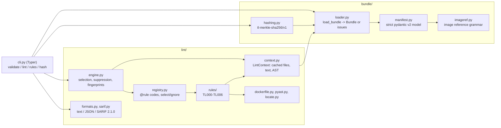

# TaskLedger

[](https://github.com/vipul21435/taskledger/actions/workflows/ci.yml)


Submission pipeline tooling for teams that build benchmark tasks for AI coding
agents: schema-checked task bundles, review lint rules, and a canonical content
hash for dedupe, with a shared collision ledger and build locks on the roadmap.

A benchmark task is a small bundle: an instruction, a pinned environment image,
a reference solution and a byte-exact grader. When dozens of people author
tasks in parallel, the expensive failures are in the pipeline, not in any one
task: two authors submit the same task with cosmetic differences, a grader
quietly downloads something at test time, an image tag drifts after review, or
a grader samples the output with an unseeded random generator. TaskLedger
catches those before a reviewer ever sees the task.

## What works today

| Command | What it does |
| --- | --- |
| `taskledger validate PATH...` | Strict pydantic v2 schema for `task.toml` plus on-disk path checks. Reports every problem at once with a precise location (`task.toml:task.version`). `--json` for machines. |
| `taskledger lint PATH...` | Rule registry with stable codes, per-rule severity and fix hints, ruff-style `--select`/`--ignore` by code or prefix (also from `[lint]` in `task.toml`), inline `taskledger: ignore[TL004]` suppression, text, JSON or SARIF 2.1.0 output with line and column. |
| `taskledger rules` | Lists the registered rules (`--json` for machines). |
| `taskledger hash PATH` | Canonical Merkle-style sha256 of a bundle: cosmetic edits (line endings, manifest formatting, author metadata, OS clutter) never change it, any semantic edit always does. This is the identity for exact-duplicate detection. |

Lint rules shipped (`taskledger rules`):

| Code | Name | Default | Catches |
| --- | --- | --- | --- |
| TL000 | invalid-bundle | error | anything `validate` rejects |
| TL001 | missing-tests | error | no grader tests, or pytest files whose tests assert nothing |
| TL002 | unpinned-base-image | error | `FROM` / `COPY --from` without `@sha256:` (multi-stage and `ARG`-substituted forms included) |
| TL003 | network-in-grader | error | network imports in the grader, `curl`/`wget`/`pip install`/`git clone` in tests, the verifier command or the verifier image's `CMD`/`ENTRYPOINT` |
| TL004 | nondeterminism | warning | wall clock, OS entropy, unseeded global `random`/`numpy.random`, salted `hash()`, set-order dependent output and unsorted directory listings in the grader or reference solution |
| TL005 | oversized-file | error | a file over `lint.max_file_kb` (default 1024 KiB) or a bundle over `lint.max_bundle_kb` (default 20480 KiB), with the largest files named |
| TL006 | committed-secret | error | 16 known key formats (cloud, code-hosting, chat, payment and model-provider keys, registry tokens, JWTs, PEM private keys, passwords in URLs) plus a Shannon-entropy check on values assigned to secret-looking names; findings are redacted |

Also shipped: two original, genuinely solvable example bundles, one
deliberately flawed bundle for the demo, a digest-pinned non-root Docker image,
and `make demo`.

## Quickstart

Requires [uv](https://docs.astral.sh/uv/) and GNU make (uv installs Python 3.12
if needed). Verified from a fresh clone:

```bash
git clone https://github.com/vipul21435/taskledger.git
cd taskledger
uv sync --frozen
make demo     # validate, lint (text and SARIF) and hash the bundled examples (offline, about 1.5 s)
make check    # ruff, mypy --strict, pytest with branch coverage
```

Or in Docker (the image carries the examples and the demo script):

```bash
make docker-demo   # docker build -t taskledger:dev . then runs scripts/demo.sh inside it
docker run --rm -v "$PWD:/work" taskledger:dev lint /work/examples/bundles/integer-linear-system
```

## CLI usage

All output below is copied from real runs in this repository.

### Lint

```console
$ taskledger lint --no-hints examples/flawed/digit-sum-report
examples/flawed/digit-sum-report/environment/Dockerfile:2:6: error TL002 unpinned-base-image: base image 'python:3.12-slim' is not pinned by digest
examples/flawed/digit-sum-report/task.toml:21:1: error TL003 network-in-grader: verifier command runs 'pip install' at test time
examples/flawed/digit-sum-report/tests/test_report.py:7:1: error TL003 network-in-grader: grader imports network module 'requests'
examples/flawed/digit-sum-report/tests/test_report.py:10:19: error TL006 committed-secret: 'UPSTREAM_TOKEN' is assigned a high-entropy value (4.6 bits per character) that looks like a secret: [redacted, 24 chars]
examples/flawed/digit-sum-report/tests/test_report.py:16:14: warning TL004 nondeterminism: 'random.sample()' uses the global random generator, never seeded in this file
examples/flawed/digit-sum-report/tests/test_report.py:23:56: warning TL004 nondeterminism: 'time.time()' reads the wall clock, so the result changes between runs
examples/flawed/digit-sum-report/verifier/Dockerfile:1:6: error TL002 unpinned-base-image: base image 'python:3.12-slim' is not pinned by digest
Found 7 findings (5 errors, 2 warnings) in 1 of 1 bundle.
$ echo $?
1

$ taskledger lint examples/bundles/*
No findings in 2 bundles.
```

Without `--no-hints` each finding is followed by its fix hint, for example
`fix: Pin the image by digest, e.g. FROM python:3.12-slim@sha256:<digest> (get
it with: docker buildx imagetools inspect python:3.12-slim).` Exit codes: 0
clean or warnings only, 1 on any error, 2 on an unknown rule code.
`--format json` emits a versioned document (`format_version: 1`) with a
summary and, per finding, code, rule, severity, file, line, column, fix and a
line-independent fingerprint:

```console
$ taskledger lint --format json examples/flawed/digit-sum-report
{
  "tool": "taskledger",
  "version": "0.1.0",
  "format_version": 1,
  "summary": {
    "bundles": 1,
    "bundles_with_findings": 1,
    "findings": 7,
    "error": 5,
    "warning": 2,
    "note": 0,
    "suppressed": 0
  },
  ...
```

### SARIF for GitHub code scanning

`--format sarif` writes one SARIF 2.1.0 log with a single run. The driver
lists every rule that ran (id, title, description, the fix hint as help, the
default level; TL006 is tagged `security` with a `security-severity` of 8.0),
and each finding becomes a result with `ruleId` and `ruleIndex`, level,
message, a physical location and a line-independent partial fingerprint.
Relative paths become percent-encoded URIs under `%SRCROOT%`, so run the
linter from the repository root; absolute paths become `file://` URIs.

```console
$ taskledger lint --format sarif examples/flawed/digit-sum-report > lint.sarif; echo $?
1
$ head -4 lint.sarif
{
  "$schema": "https://json.schemastore.org/sarif-2.1.0.json",
  "version": "2.1.0",
  "runs": [
```

One of its 7 results (the redacted TL006 secret):

```json
{
  "ruleId": "TL006",
  "ruleIndex": 6,
  "level": "error",
  "message": {
    "text": "'UPSTREAM_TOKEN' is assigned a high-entropy value (4.6 bits per character) that looks like a secret: [redacted, 24 chars]"
  },
  "locations": [
    {
      "physicalLocation": {
        "artifactLocation": {
          "uri": "examples/flawed/digit-sum-report/tests/test_report.py",
          "uriBaseId": "%SRCROOT%"
        },
        "region": {
          "startLine": 10,
          "startColumn": 19,
          "endLine": 10,
          "endColumn": 43
        }
      }
    }
  ],
  "partialFingerprints": {
    "taskledger/v1": "4f47be9beb1c4d8e70905dd469d32298"
  }
}
```

`taskledger.lint.sarif_problems(document)` checks a log against every
property the SARIF 2.1.0 schema marks as required (plus its enums and
minimums, and that each `ruleIndex` points at the rule with the result's id)
and the result fields GitHub code scanning requires (`ruleId`,
`message.text`, an artifact URI and `region.startLine`). The tests run it
over real lint output and over hypothesis-generated reports, and delete or
corrupt each required field of a valid log to prove the check is enforced
(`tests/test_lint_sarif.py`). In a workflow, keep the upload step running
when the lint step fails:

```yaml
- run: uv run taskledger lint --format sarif examples/bundles/* > lint.sarif
- uses: github/codeql-action/upload-sarif@v4
  if: always()
  with:
    sarif_file: lint.sarif
    category: taskledger
```

### Secrets and size limits

TL006 scans every text file line by line (files above the 4 MiB content cache
are streamed, so size never hides a key) and never prints the credential: a
known format keeps only its public prefix (`ghp_[redacted, 40 chars]`), a
generic secret only its length. The entropy check only looks at values
assigned to secret-looking names (`api_key`, `"token":`, `DB_PASSWORD=`), so
sha256 digests and base64 fixtures do not trip it, and placeholders such as
`changeme`, `${TOKEN}` or `<token>` are skipped. TL005 limits come from
`[lint]` in `task.toml`:

```toml
[lint]
max_file_kb = 1024      # per file (default)
max_bundle_kb = 20480   # whole bundle (default)
```

### Validate

```console
$ taskledger validate examples/bundles/*
ok       examples/bundles/integer-linear-system  (integer-linear-system 1.0.0)
ok       examples/bundles/modular-inverse-table  (modular-inverse-table 1.0.0)

$ taskledger validate broken
invalid  broken  (4 issue(s))
  task.toml:task.id: must be a lowercase slug of 3-64 characters (letters, digits and single hyphens), got 'Modular_Inverse'
  task.toml:task.version: must be a semantic version such as 1.0.0 or 2.1.0-rc.1, got '1.0'
  task.toml:instruction.path: must stay inside the bundle, got '../instruction.md'
  task.toml:resources.cpus: Input should be a valid number
```

(`broken` is a copy of `examples/bundles/modular-inverse-table` with those four
manifest values edited.) Schema errors are reported first; once the manifest
is valid, every declared path is checked on disk (`file not found`, `expected
a directory`, `resolves outside the bundle`).

### Hash

| Never changes the hash (cosmetic) | Always changes the hash (semantic) |
| --- | --- |
| CRLF or CR line endings in text files | any other byte of any file |
| `task.toml` comments, whitespace, key and table order, quoting, defaults written out | any other manifest value (title, version, tags, limits, command, ...) |
| `authors`, `created_at`, `notes` metadata | adding, removing or renaming a file |
| `.DS_Store`, `__pycache__`, `*.pyc`, `.git`, tool caches | retargeting a symlink (links are hashed, never followed) |
| empty directories, file modes, timestamps, NFC vs NFD file names | |

Real run on a copy of `examples/bundles/modular-inverse-table` (every text
file converted to CRLF, a `.DS_Store` added, the author changed, then one
grader line appended):

```console
$ taskledger hash .
sha256:0991c712d5e379e7cad99b4acebfcd916dcc90ea5e997c8684d6e44846c6c2aa  .
$ # CRLF everywhere, .DS_Store, different author
$ taskledger hash .
sha256:0991c712d5e379e7cad99b4acebfcd916dcc90ea5e997c8684d6e44846c6c2aa  .
$ echo "# stricter" >> tests/test_inverses.py
$ taskledger hash .
sha256:22da1ce1dd43cfb2814c25bdf60c719740e0acdff3a2917c9b338449ce08d93f  .
```

The same bundle hashes identically on macOS (arm64) and inside the Linux
container (`make demo` and `make docker-demo` print the same digests).
`--json` adds per-file digests; for LF-only text a file digest equals
`sha256sum`.

## Architecture



- **Rules never touch the file system.** They ask `LintContext` for the
  layout, file list, text, lines or parsed AST; every read and parse is cached
  per bundle, so five rules looking at one file cost one read.
- **The layout comes from the manifest, best effort.** If `task.toml` is
  invalid, each section is validated on its own and falls back to the
  conventional layout only where it is broken, so a typo in `[task]` does not
  hide a missing grader (TL000 reports the typo, the other rules still run).
- **Names are resolved, not spelled.** `pyast.ImportTable` maps local names to
  fully qualified ones, so `from datetime import datetime as dt; dt.now()` is
  matched as `datetime.datetime.now`.

## Measured numbers

Every number below comes from a command run on this repository at the commit
that last updated this table (macOS arm64, Python 3.12, Docker 29).

| Metric | Value | Reproduce with |
| --- | --- | --- |
| Tests | 575 passed | `uv run pytest -q` |
| Branch coverage | 99.39% (gate: 85%) | `make cov` |
| Lint rules registered | 7 (TL000-TL006) | `uv run taskledger rules` |
| Findings on the flawed example | 7 (5 errors, 2 warnings), exit 1 | `uv run taskledger lint examples/flawed/digit-sum-report` |
| Findings on the two sample bundles | 0 | `uv run taskledger lint examples/bundles/*` |
| SARIF problems in the flawed example's log | 0 (`[]`; 7 results, 7 rules) | `uv run taskledger lint -f sarif examples/flawed/digit-sum-report \| uv run python -c "import json, sys; from taskledger.lint import sarif_problems; print(sarif_problems(json.load(sys.stdin)))"` |
| `make demo` wall time | 1.50 s | `/usr/bin/time -p make demo` |
| Docker image | 51 MB compressed, 236 MB unpacked | `make docker-build && docker image ls taskledger:dev` |

The hash properties in the table above are hypothesis property tests
(`tests/test_hashing_properties.py`; CI runs them with
`HYPOTHESIS_PROFILE=ci`, up to 400 examples per property). The sample bundles
are checked end to end by `tests/test_examples.py`: each grader must reject the
untouched baseline, accept the reference solution twice, and reject a
reference output with one extra line.

## Design decisions

- **Hash the validated manifest, not TOML bytes.** Canonical JSON of the model
  with defaults excluded and metadata dropped, so formatting and spelled-out
  defaults are cosmetic and a new defaulted field in a later schema version
  does not change existing hashes.
- **Text vs binary by NUL byte** (the usual git heuristic); only text gets
  line endings normalized, and the normalizer streams in chunks (a property
  test covers CRLF split across a chunk boundary).
- **Symlinks are hashed by target and never followed**; directory entries
  carry a kind byte, so a file and a directory can never collide.
- **Strict schema everywhere.** No `"5"` to `5` coercion, unknown keys are
  errors, every path must stay inside the bundle (also through symlinks).
- **Environment images build from `baseline/`**, so a reference solution can
  never leak into the agent image by construction.
- **Stable rule codes plus ruff-style selection.** Layers apply in order
  (`task.toml`, then CLI); the more specific selector wins and `ignore` wins a
  tie, so `--select TL004` on the command line re-enables a rule a bundle
  ignored.
- **Fingerprints ignore line numbers** (code, file, message, occurrence), so
  moving code does not make an old finding look new to code-scanning tools.
  The SARIF fingerprint also hashes the artifact URI, so the same finding in
  two bundles stays two alerts.
- **Secret findings are redacted at the source.** The rule builds the message
  from a redacted form, so no formatter, log or SARIF upload can leak the
  credential.
- **The image practices what TL002 preaches:** both base images in the
  Dockerfile are pinned by digest, dependencies come from `uv.lock`, and the
  runtime user is non-root (uid 10001).

## Task bundle format

A task bundle is a directory with a `task.toml` manifest. Every section except
`[task]` is optional and defaults to the conventional layout below.

```
modular-inverse-table/
  task.toml               manifest: id, semver version, images, limits
  instruction.md          what the agent is asked to do
  environment/Dockerfile  image the agent works in (digest-pinned base)
  verifier/Dockerfile     image the grader runs in
  solution/solve.sh       reference solution that computes the answer
  tests/                  byte-exact pytest grader
  baseline/               optional untouched starting workspace
```

A minimal manifest:

```toml
schema_version = 1

[task]
id = "sum-of-squares"        # lowercase slug, 3-64 chars
version = "1.0.0"            # semantic version
title = "Sum of squares of a list"
category = "arithmetic"
```

The full model lives in
[`src/taskledger/bundle/manifest.py`](src/taskledger/bundle/manifest.py).
Examples: [`examples/bundles/`](examples/bundles/) holds a modular-inverse
table over a composite modulus and a unimodular integer linear system
(determinant +1 or -1, so exactly one integer answer), both original, with
graders that recompute every answer independently and pin the input by digest.
[`examples/flawed/`](examples/flawed/) holds the bundle the demo lints.

## Roadmap

Not built yet; tracked slice by slice in [PLAN.md](PLAN.md).

- **Dedupe cache and ledger core:** a content-addressed object store, a shared
  SQLAlchemy ledger (SQLite, Postgres by URL) with exact and ID collisions, a
  review state machine and a hash-chained, append-only audit log.
- **Near-duplicate detection:** pure-Python MinHash + LSH over instruction
  shingles and normalized solution tokens.
- **Build locks:** `fcntl` file locks, DB leases with fencing tokens and stale
  recovery, and a build cache so each environment is built once.
- **Review gates:** reference passes, baseline fails, grader determinism
  re-runs, with JSON, Markdown and JUnit reports and a composite GitHub Action
  that uploads the lint SARIF to code scanning.
- **Service:** FastAPI + Prometheus metrics, docker-compose with Postgres.
- **Benchmarks and docs:** throughput, near-dup precision/recall, lease
  contention, generated rule reference.

`.env.example` lists the settings those slices will read; the current CLI
reads none of them.

## Development

| Command | What it runs |
| --- | --- |
| `make lint` | `ruff check` and `ruff format --check` |
| `make typecheck` | `mypy --strict` over `src/` |
| `make test` | `pytest -q` |
| `make cov` | pytest with branch coverage, fails under 85% |
| `make check` | all of the above, same as CI |
| `make demo` | `scripts/demo.sh` on the host |
| `make docker-build` / `make docker-demo` | build the image (and prune dangling layers) / run the demo in it |

CI (`.github/workflows/ci.yml`) runs `make check`'s steps and, in a second
job, `make demo` plus the same demo inside a freshly built image. A third job,
on pushes to `main`, lints the sample bundles with `--format sarif`, checks
the log with `sarif_problems` and uploads it to GitHub code scanning with
`github/codeql-action/upload-sarif@v4` (`wait-for-processing: true`, so the
job fails if GitHub cannot process the log).

## Why this exists

It is modeled on submission tooling I built for benchmark-task work at an
AI-data company: build recipes, collision detection against a shared ledger,
build locks and dedupe caches that let a team submit tasks in parallel without
duplicates, broken graders or wasted builds. Everything in this repository,
including every example task, rule and dataset, is original.

## License

MIT, see [LICENSE](LICENSE).
